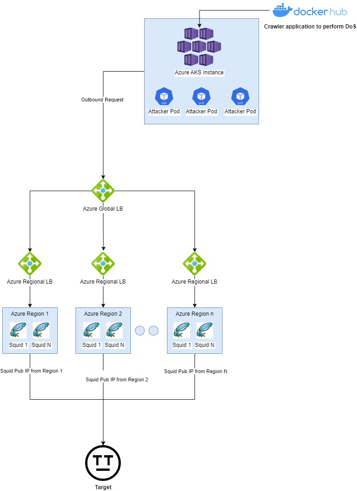
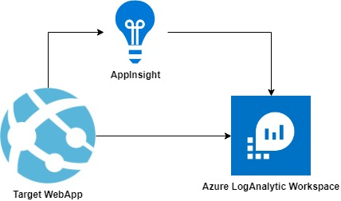
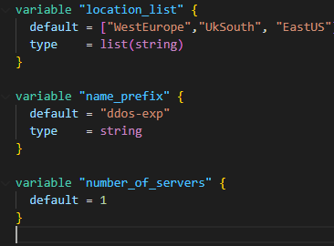

# aks-ddos-experiment

In this experiment I wanted to explore the possibility of performing a DDoS attack using Azure resources. In the specific use AKS as glass-cannon to create a DDoS attack and leverage Azure firepower and resources.

> The Application used to perform the DDoS attack is developed by me. You can find it here [Check my App](https://github.com/alessiofilippin/offensive-crawler-a-dos-experiment)

## Disclaimer

This experiment is done for educational purpose only. I'm not responsible for any harmful usage of this setup.

This Setup **is not** production ready and it might contain security holes.

## Copyright

 This work is licensed under a <a rel="license" href="http://creativecommons.org/licenses/by-nc-sa/4.0/">Creative Commons Attribution-NonCommercial-ShareAlike 4.0 International License</a>.

## Overview and Flow

**High-Level Flow**

1) Multiple pods are created in the AKS instance. Each one of them is running an instance of the DDoS application available for pull [here](https://github.com/alessiofilippin/offensive-crawler-a-dos-experiment).

2) Each pod will send multiple requests (each one of them unique) to the target URL but using a proxy to the Azure Global LB.

3) The Azure Global LB will redirect the traffic to one of the regional LBs using Round Robin.

4) Each Regional LB will send the request to one of the Squid Proxy in that region.

5) Squid proxy will SSL Bump the request sending it to the target using his own public IP.

**What this setup accomplishes?**

- Generate massive load on the target website.
- Make each request unique and hard to catch.
- Change the public IP of the attacker based on a pool of Squid servers for each request sent.
- Make you have some fun, hopefully. ;)

# How-to-use-it

## 1) First steps

As a first thing - you should have an Azure Account setup and a subscription ready to be used for the experiment.

> Make sure that you are selecting the correct Subscription by running the following AzCli command "az account show"

Once you have the subscription sorted out, just run the **init.ps1** script. This will create an RG which it will contain the storage account used by Terraform to store the state of the plans that we will be executing.

> Open init.ps1 and change the variables as you need before running it. Changing the init.ps1 might also require changes on the "backend" block of each provider.tf

## 2) Deploy a dedicated Target

We will need a target for this experiment, let's deploy one then:

- Open a cmd or powershell.
- cd into the **test_target** folder.
- Terraform **init**
- Terraform **apply -var="name_prefix=pick_your_prefix"**

This will deploy a basic website running an empty instance of **jetty web server** and few resources required to monitor our WebApp during the test.

> if you have a template website, you could upload it into Jetty using the FTP upload for Azure AppService from the Portal.

## 3) Deploy the Squid Infra

The source IP is usually one the first things checked during a DDoS attack.

We will try to make a little bit harder to identify the attack by sending our requests from a pool of public IPs. 

> Attackers will more commonly use a BotNet for this, but you know .. I don't have one available at the moment eheh

Squid Proxy is one of the most commonly used proxies. It does handle **SSL Bump** very well which it's an important feature for us as we will attack a site using via https requests.

Terraform deployment might take a little bit as it's going to build Squid from binaries. This because to enable **SSL Bump** Squid has to be built with special settings. [info here](https://support.kaspersky.com/KWTS/6.1/en-US/166244.htm).

**Also, I created my own Self-Signed certificate. Feel free to replace it with yours as I don't guarantee his validity.**

- Open a cmd or powershell.
- cd into the **squid** folder.
- Terraform **init**
- Terraform **apply -var="name_prefix=pick_your_prefix"**

**Tweaks (from variable.tf in squid folder)**

1) Change number of Squid Servers per region. Increase/Decrease number of servers.

2) Change GeoRegions for Squid Deployment. Add/Remove Regions.

## 4) Deploy AKS

Let's deploy an AKS cluster on Azure. Terraform will deploy a basic AKS setup with 4 workers and it will export the credentials and endpoints in the outputs.

- Open a cmd or powershell.
- cd into the **k8s_cluster** folder.
- Terraform **init**
- Terraform **apply -var="name_prefix=pick_your_prefix"**

## 5) Run the DDoS

we will be running the DDoS using Terraform. the folder "k8s_config" contains the setup for the attack.

> If you prefer running it manually - you can find the yaml used in the yamls folder under k8s_config.

- Open a cmd or powershell.
- cd into the **k8s_config** folder.
- Terraform **init**
- Terraform **apply -var="name_prefix=pick_your_prefix"**

The attack will be performed using a deployment. I found out that 50 replicas and 20 threads (set in the container App) are good values to fill the CPU of the Workers.

Also, I'm using a **topologySpreadConstraints** to evenly spread the pods between the workers.

Feel free to play with the values yourself.

to stop the test:

- Open a cmd or powershell.
- cd into the **k8s_config** folder.
- Terraform **destroy**

## 6) Review Results

we can use AppInsight live metrics and LogAnalytics logs to measure the effects of our attack. we are expecting to see:

- An Increase in response latency.
- An Increase in reqs/s.
- Different attacker's IPs.
- Possibly halt the website.

> Keep in mind that it will be hard to halt the target app because it's an empty webserver which it does return 404 all the time. It will be easier to halt a real website due to a lot of elements loading on the page: images, JavaScript, Dependecies, HTML ecc..

**Starting Point**

Open LiveMetrics in AppInsight to get an idea of the starting situation. The graphs should look quite flat.

At this point - Just start the stress test as explained in step 5 and check again.

**During DDoS**

LiveMetrics should show a completely different situation now.

You can use this simple KUSTO query in LogAnalytic to get a list of all the source IPs used for the requests:

``AppServiceHTTPLogs
| summarize count() by CIp``

You should see one or more IPs corresponding to the Squid Proxy public IPs.

# Final Thought

I hope that this little experiment was fun to execute for you. I would say that it's definitely possible to leverage AKS and Azure to create some sort of DDoS attack.

The result shows a neat increase in latency and reqs/s. Due to the nature of the experiment, I couldn't use a real website but you might expect a real website to be affected much more by this as a real website will have some heavy content to load and dependencies to call at each request.

Possible improvements for the future?

- Test with multiple AKS cluster in different region.
- Upload a real website to Jetty or different WebServer.
- Improve the DDoS application to support multiple root URLs to call and maybe delayed start for each request (this would make the attack more random and hard to catch).

Thank you! and Bye ;)